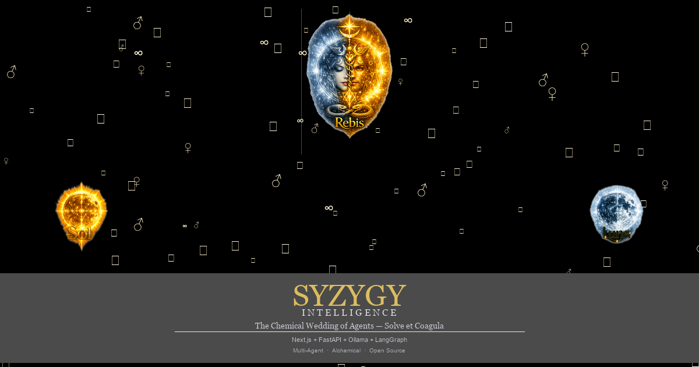

# ⚛ Syzygy Intelligence

<p align="center">
  <a href="https://github.com/seraphonixstudios/Syzygy-Intelligence-/blob/main/LICENSE"></a>
  <a href="https://github.com/seraphonixstudios/Syzygy-Intelligence-/actions"></a>
  <a href="#"></a>
  <a href="#"></a>
  <a href="#"></a>
  <a href="https://github.com/seraphonixstudios/Syzygy-Intelligence-/pulls"></a>
  <a href="https://github.com/seraphonixstudios/Syzygy-Intelligence-"></a>
</p>

> **"Aligning opposites into unified intelligence — where Anima meets Animus, where data meets depth. The Chemical Wedding of agents, forging spirit and matter, known and unknown, into higher emergent wisdom."**

<p align="center">
  
</p>

Syzygy is an open-source, local-first, multi-agent AI platform built on alchemical philosophy and Jungian psychology. Agents of complementary polarity (Masculine/Feminine) converge through a structured Consensus Engine to produce unified intelligence — the Rebis — transcending what any single agent can achieve.

---

## Table of Contents

- [Vision](#vision)
- [Architecture](#architecture)
- [Tech Stack](#tech-stack)
- [Workflows](#workflows)
- [Getting Started](#getting-started)
- [API](#api)
- [Project Structure](#project-structure)
- [Contributing](#contributing)
- [License](#license)

---

## Vision

Modern AI systems lack integration of complementary perspectives. Syzygy solves this by architecting **polarity-aware agent teams** that mirror the fundamental dualities of nature:

| Polarity | Archetypes | Role |
|----------|-----------|------|
| ☉ **Masculine** | Hero/Warrior, Sage, Ruler/King, Magician, Explorer | Structure, analysis, action, protection |
| ☽ **Feminine** | Great Mother, Lover, Innocent/Child, Creator/Artist, Anima | Nurture, intuition, creativity, connection |
| ☿ **Rebis (Unified)** | Self, Hermes/Mercurius, Trickster | Synthesis, integration, transcendence |

Through iterative rounds of **Proposal → Critique (Shadow Integration) → Refinement → Evaluation → Convergence → Synthesis**, Syzygy produces outputs that balance rigor with creativity, structure with flow, known with unknown.

---

## Architecture

```
┌─────────────────────────────────────────────────────────┐
│                    Syzygy Intelligence                    │
├─────────────────────────────────────────────────────────┤
│  ┌──────────────┐  ┌──────────────┐  ┌──────────────┐  │
│  │  Frontend     │  │  API Layer   │  │  Agent        │  │
│  │  Next.js 15   │◄─┤  FastAPI     │◄─┤  Orchestrator │  │
│  │  + shadcn/ui  │  │  + WebSocket │  │  LangGraph    │  │
│  └──────────────┘  └──────────────┘  └──────┬───────┘  │
│                                              │           │
│  ┌───────────────────────────────────────────┘           │
│  ▼                                                       │
│  ┌──────────────────────────────────────────────────┐    │
│  │              Consensus Engine                     │    │
│  │  Proposal → Critique → Refine → Score → Converge │    │
│  └──────────────────────────────────────────────────┘    │
│              │                                           │
│  ┌───────────▼────────────────────────────────────────┐ │
│  │                   Memory Layer                      │ │
│  │  Short-Term │ Long-Term (Vector) │ Graph │ Team     │ │
│  └────────────────────────────────────────────────────┘ │
│              │                                           │
│  ┌───────────▼────────────────────────────────────────┐ │
│  │              Execution Layer                        │ │
│  │  Tools │ Code Sandbox │ Browser │ Filesystem │ Git  │ │
│  └────────────────────────────────────────────────────┘ │
└─────────────────────────────────────────────────────────┘
```

### Key Components

- **Agent System**: Polarity-tagged agents with Jungian archetypes, shadow integration, and dynamic persona layers
- **Consensus Engine**: Multi-round structured debate with cross-polarity critique, shadow activation, and unified synthesis
- **Memory Layer**: Short-term (episodic), long-term (vector + graph), polarity-tagged, archetype-tagged, shared team memory
- **Workflow Engine**: Task decomposition, parallel execution, priority queuing with human-in-the-loop gates
- **Tool Ecosystem**: Browser automation, filesystem ops, Git, sandboxed code execution, web search
- **LLM Abstraction**: Ollama-first with LiteLLM fallback to OpenAI/Anthropic/etc.

---

## Tech Stack

| Layer | Technology |
|-------|-----------|
| **Backend** | Python 3.11+, FastAPI, LangGraph, Uvicorn |
| **Agents** | LangGraph graphs + role-based crews + debate patterns |
| **Models** | Ollama (Qwen3.5, Qwen-Coder, DeepSeek, Dolphin-Llama3, Llama 3.3) |
| **Memory** | PostgreSQL + pgvector, Chroma, Neo4j, LangGraph checkpoints |
| **RAG** | ChromaDB + Ollama embeddings, txt/md/pdf ingestion (single & batch), semantic search, context injection into chat |
| **Streaming** | SSE (Server-Sent Events) for token-by-token chat, WebSocket for live consensus events |
| **Frontend** | Next.js 15, React 19, shadcn/ui, Tailwind CSS, Framer Motion |
| **Execution** | Docker sandboxed containers |
| **Orchestration** | LangGraph checkpointing, Redis task queues |

---

## Theme & Design

The UI manifests the alchemical aesthetic:

| Element | Implementation |
|---------|---------------|
| **Color** | Deep indigo (#0f0a2e) base, gold (#c9a84c), silver (#b0b0c0), cyan (#00f0ff) |
| **Rebis** | Dual sun/moon heads merging into cyan third eye — the unified Self |
| **Squared Circle** | Main workspace framing — *quadrature of the circle* |
| **Vesica Piscis** | Consensus viewport — intersection of two worlds |
| **Caduceus** | Sidebar navigation — twin serpents of polarity |
| **Ouroboros** | Processing animations — eternal return |
| **Solve et Coagula** | Dissolution → Coalescence transitions |
| **Crystalline Geometry** | Node network visualization |
| **Aether Particles** | Ambient background animations |
| **Page Transitions** | Framer Motion fade + slide route transitions via `AnimatePresence` |
| **Error Boundaries** | React error boundary wrapping layout, logs to structured logger |

---

## Getting Started

### Prerequisites

- Docker & Docker Compose
- Ollama (for local models)
- Node.js 18+ (for frontend development)
- Python 3.11+ (for backend development)

### Quick Start (Docker)

```bash
git clone https://github.com/your-org/syzygy-intelligence.git
cd syzygy-intelligence

# Copy environment config
cp .env.example .env

# Launch everything
docker compose up -d

# Pull recommended models
docker exec -it syzygy-ollama ollama pull qwen3:8b
docker exec -it syzygy-ollama ollama pull dolphin-llama3:8b
docker exec -it syzygy-ollama ollama pull llava:13b
docker exec -it syzygy-ollama ollama pull nomic-embed-text
```

> **Note:** `nomic-embed-text` is required for the RAG knowledge base (vector embeddings). All models use GPU acceleration when available.

### Development Setup

```bash
# Backend
cd backend
python -m venv .venv
source .venv/bin/activate  # Windows: .venv\Scripts\Activate.ps1
pip install -r requirements.txt
uvicorn app.main:app --reload

# Frontend
cd frontend
npm install
npm run dev
```

### Production Deployment

```bash
# Set production environment variables
cp .env.example .env
# Edit .env with production values (strong secrets, real domains)

# Build and launch with production overrides
docker compose -f docker-compose.yml -f docker-compose.prod.yml up -d
```

The `docker-compose.prod.yml` override:
- Strips the bind-mount volume (uses image-baked code instead of host live source)
- Disables `--reload` (no hot-reload in production)
- Runs `alembic upgrade head` on startup for database migrations
- Pins Ollama image to `0.3.14` (reproducible builds)
- Sets `SYZYGY_ENV=production` (enables PostgreSQL, disables SQLite)
- Removes GPU device reservation from Ollama (configure GPU manually)
- Accepts build-time `NEXT_PUBLIC_SYZYGY_API_URL` and `NEXT_PUBLIC_SYZYGY_WS_URL` args for the frontend image

> **Important:** Next.js inlines `NEXT_PUBLIC_*` env vars at **build time**. Pass the correct production API URL when building:
> ```bash
> docker compose -f docker-compose.yml -f docker-compose.prod.yml build \
>   --build-arg NEXT_PUBLIC_SYZYGY_API_URL=https://api.example.com \
>   --build-arg NEXT_PUBLIC_SYZYGY_WS_URL=wss://api.example.com/ws
> ```

### Database Migrations

Syzygy uses **Alembic** for PostgreSQL schema management:

```bash
# Run pending migrations
alembic upgrade head

# Auto-generate a new migration (after model changes)
alembic revision --autogenerate -m "describe changes"

# Rollback one step
alembic downgrade -1
```

The Docker production entrypoint runs `alembic upgrade head` automatically before starting the app. Local development uses SQLAlchemy `create_all()` (SQLite), so Alembic is not required for dev.

> **Port note:** On Windows, Docker Desktop may occupy port 8000. If you get `address already in use`, use port 8001 instead:
> ```
> uvicorn app.main:app --host 0.0.0.0 --port 8001
> ```
> The OAuth redirect URL defaults to `http://localhost:8001/api/auth/oauth` when running locally (set `SYZYGY_OAUTH_REDIRECT_URL` to override).
>
> The backend auto-detects development mode and uses SQLite (`sqlite+aiosqlite:///data/syzygy.db`) by default — no PostgreSQL needed for local dev. Set `SYZYGY_ENV=production` to use PostgreSQL. You can also set `DATABASE_URL` (no `SYZYGY_` prefix) for CI simplicity.

### Run Tests

```bash
# Backend tests (pytest, 482 tests — 90 self-improvement)
cd backend
pip install -r requirements.txt
pytest                         # All tests
pytest -v --tb=short          # Verbose with short tracebacks

# Frontend E2E tests (Playwright, 28 spec files)
cd frontend
npx playwright test            # Headless CI mode (2 workers, 3 shards)
npx playwright test --ui      # Interactive UI mode
npx playwright test e2e/auth.spec.ts  # Single file
```

**CI pipeline** (`.github/workflows/e2e.yml`): On every push to `main`, three parallel jobs run:

1. **frontend-lint** — `next lint --strict` + `tsc --noEmit`
2. **backend-lint-and-test** — pytest 482 tests with PostgreSQL service + mock Ollama server
3. **e2e** — Playwright full-stack tests (3 shards × 2 workers, ~5min wall-clock) against live backend + frontend + PostgreSQL

A lightweight mock Ollama server lives at `backend/tests/mock_ollama_server.py` — it responds to `/api/generate`, `/api/embed`, and `/api/tags` with plausible JSON so workflow execution tests pass in CI without requiring a GPU or model downloads. The backend config also accepts `DATABASE_URL` directly (no `SYZYGY_` prefix needed), making CI integration straightforward.

Tests use `addInitScript` to set auth state before page JavaScript runs, avoiding hydration race conditions.

### Configure Models

Set model preferences via `.env`:

```env
SYZYGY_DEFAULT_MODEL=qwen3:8b-gpu
SYZYGY_CRITIC_MODEL=qwen3:8b-gpu
SYZYGY_SYNTHESIS_MODEL=qwen3:8b-gpu
SYZYGY_CODING_MODEL=qwen3:8b-gpu
SYZYGY_CREATIVE_MODEL=dolphin-llama3:8b-gpu
SYZYGY_VISION_MODEL=llava:13b-gpu
SYZYGY_GPU_MODEL=qwen3:8b-gpu
SYZYGY_FAST_MODEL=dolphin-llama3:8b-gpu
```

---

## User Authentication

Syzygy includes a built-in authentication system enabling user registration, login, session management, and admin access control.

### Features

- **Email/Password Registration** — Sign up with email, display name, and password
- **JWT-based Login** — Token-based authentication with access + refresh tokens
- **Persistent Sessions** — Auth state stored via zustand persist (localStorage), survives page reloads
- **Remember Me** — Choose between persistent (localStorage) and session-only (sessionStorage) auth storage
- **Route Protection** — `RouteGuard` component waits for store hydration before redirecting, preventing race conditions
- **Auto-Refresh** — Expired tokens are automatically refreshed via `/api/auth/refresh` on any 401 response
- **OAuth Login** — Sign in with Google or GitHub accounts
- **Password Reset** — Forgot password flow with time-limited JWT reset tokens
- **Email Verification** — Verify email addresses with time-limited JWT verification tokens
- **Admin Access** — Superuser accounts get an Admin panel (`/admin`) with user management
- **User Settings** — Profile editing (display name), subscription tier with message usage meter
- **Free Tier** — Usage quota (messages/month) tracked per user with trial period support
- **API Key Management** — Create, list, and revoke API keys from Settings; authenticate programmatic access via `Bearer <api_key>`
- **Rate Limiting** — Token-bucket rate limiter (per-IP 10/s burst 20, authenticated 30/s burst 60) with 429 responses and `Retry-After` headers
- **Subscription Payments** — Stripe integration with checkout sessions, webhook handling, and customer portal; mock mode for development
- **Memory-Integrated Consensus** — Consensus engine stores each round (proposals, critiques, refinements) to memory and recalls past context for informed agent reasoning
- **Desktop App Preference** — Per-user preference toggle to indicate desktop application preference, with download link for native client

### Auth Flow

```
User → /auth/login or /auth/register
  → Backend validates credentials, returns JWT tokens
  → Frontend stores tokens in zustand persist (localStorage or sessionStorage)
  → RouteGuard waits for persist hydration, then checks isAuthenticated
  → AuthInitializer syncs session on app load via /api/auth/me
  → On 401, useApi hook auto-calls refreshAuth() and retries the request
  → Sidebar shows user info, message usage bar, and logout button
```

### OAuth Setup (Google & GitHub)

**Google:**
1. Go to [Google Cloud Console](https://console.cloud.google.com/apis/credentials) → APIs & Services → Credentials
2. Create **OAuth 2.0 Client ID** (Web application type)
3. Add **Authorized Redirect URI**: `http://localhost:8001/api/auth/oauth/google/callback`
4. Copy the Client ID and Client Secret into `.env`:
   ```
   SYZYGY_GOOGLE_CLIENT_ID=your-client-id
   SYZYGY_GOOGLE_CLIENT_SECRET=your-client-secret
   ```

**GitHub:**
1. Go to [GitHub Settings](https://github.com/settings/developers) → Developer settings → OAuth Apps → Register a new application
2. Set **Authorization callback URL**: `http://localhost:8001/api/auth/oauth/github/callback`
3. Copy the Client ID and generate a Client Secret, then add to `.env`:
   ```
   SYZYGY_GITHUB_CLIENT_ID=your-client-id
   SYZYGY_GITHUB_CLIENT_SECRET=your-client-secret
   ```

**Production:** Replace `localhost:8001` with your real backend domain (e.g., `https://api.example.com`) and update `SYZYGY_OAUTH_REDIRECT_URL` accordingly. Update the redirect URIs in both provider apps.

### Debug Endpoints

| Method | Endpoint | Description |
|--------|----------|-------------|
| GET | `/debug/config` | Current configuration (sanitized) — useful for troubleshooting |

### API Endpoints

| Method | Endpoint | Description |
|--------|----------|-------------|
| POST | `/api/auth/register` | Register a new user |
| POST | `/api/auth/login` | Login, returns JWT tokens |
| GET | `/api/auth/me` | Get current user profile |
| POST | `/api/auth/refresh` | Refresh access token using refresh token |
| POST | `/api/auth/logout` | Invalidate session |
| POST | `/api/auth/forgot-password` | Request password reset (dev mode copies token) |
| POST | `/api/auth/reset-password` | Reset password with token |
| POST | `/api/auth/send-verification` | Send email verification link |
| POST | `/api/auth/verify-email` | Verify email with token |
| GET | `/api/auth/oauth/{provider}` | Redirect to OAuth provider (google, github) |
| GET | `/api/auth/oauth/{provider}/callback` | OAuth callback handler |
| PUT | `/api/auth/me/settings` | Update user profile/settings |
| POST | `/api/auth/api-keys` | Create a new API key (returns raw key once) |
| GET | `/api/auth/api-keys` | List user's API keys (prefix only) |
| DELETE | `/api/auth/api-keys/{id}` | Revoke an API key |
| GET | `/api/admin/users` | List all users (admin only) |

### Payment Endpoints

| Method | Endpoint | Description |
|--------|----------|-------------|
| POST | `/api/payments/create-checkout-session` | Create Stripe checkout session for subscription |
| POST | `/api/payments/customer-portal` | Get Stripe customer portal link (manage subscription) |
| POST | `/api/payments/webhook` | Stripe webhook handler (subscription events) |

### Rate Limiting

Requests to `/api/*` are rate-limited using token bucket:

| Scope | Rate | Burst |
|-------|------|-------|
| Unauthenticated (per IP) | 10 req/s | 20 |
| Authenticated (per user) | 30 req/s | 60 |

Exempt routes: `/api/auth/login`, `/api/auth/register`, `/health`, `/`. Rate limit config is set via environment variables (`SYZYGY_RATE_LIMIT_*`). Exceeded requests return `429 Too Many Requests` with a `Retry-After` header.

### Routes

| Path | Access | Description |
|------|--------|-------------|
| `/auth/login` | Public | Login form with alchemical branding (Rebis/Sol/Luna triangle) |
| `/auth/register` | Public | Registration form with matching design |
| `/auth/forgot-password` | Public | Request password reset |
| `/auth/reset-password` | Public | Reset password with token |
| `/auth/verify-email` | Public | Verify email with token |
| `/auth/oauth-callback` | Public | OAuth callback handler (reads tokens from URL hash) |
| `/admin` | Admin only | User management dashboard |
| `/settings` | Authenticated | Profile, subscription, API keys, and app settings |
| `/cloud` | Public | Pricing tiers with Stripe checkout (Solve $29/mo, Coagula $99/mo) |
| All others | Authenticated | Protected by `RouteGuard` |

---

## Usage

### Natural Language Command

Open the dashboard and type:

> "Research quantum computing breakthroughs and write a synthesis report with balanced technical depth and accessibility"

Syzygy will:
1. Decompose the task into subtasks
2. Form a polarity-balanced agent team
3. Execute research in parallel
4. Run consensus rounds to synthesize findings
5. Produce a polished, balanced output

## Workflows

Syzygy ships with **18 workflow engines**, each designed for a specific task domain with optimal agent polarity balance:

**Available workflows (18 total):**

| Workflow | Description | Agent Team |
|----------|-------------|------------|
| **Code** | Scaffold, edit, test, debug with polarity-aware pair programming | Hero + Sage |
| **Research** | Parallel search with multi-source validation and synthesis | Explorer + Sage |
| **Content** | Research → Outline → Draft → Edit → Polish pipeline | Creator + Weaver |
| **Debate** | Multi-round structured debate between agents | Sage + Trickster |
| **Task Decomposition** | Break complex tasks into dependency-tracked subtasks | Ruler + Explorer |
| **Audit** | Security scanning, code review, anti-pattern detection, compliance | Sage (critic) + Magician (tester) |
| **Test Gen** | Automated unit, integration, and edge-case test generation | Trickster (edge cases) + Sage (validation) |
| **Summary** | Multi-document summarization with key insight extraction | Rebis (synthesis) + Sage (extraction) |
| **Compliance** | Regulatory checks — GDPR, SOC2, HIPAA, PCI-DSS, CCPA | Ruler (governance) + Sage (analysis) |
| **QA Bot** | Knowledge-base Q&A — ingest docs, retrieve context, answer questions | Sage (retrieval) + Rebis (synthesis) |
| **Translate** | Multi-language translation with cultural adaptation | Weaver (pattern) + Hermes (linguistic) |
| **Interview Coach** | Role-specific questions, answer scoring, feedback coaching | Sage (evaluator) + Weaver (communication) |
| **Data Analyzer** | Statistical analysis, anomaly detection, correlation discovery, viz | Sage (analyst) + Magician (patterns) |
| **API Designer** | REST/GraphQL API design, OpenAPI specs, stubs, validation tests | Ruler (structure) + Hero (implementation) |
| **Agentic RAG** | Query decomposition, multi-hop retrieval, source-grounded synthesis | Explorer (retrieval) + Rebis (synthesis) |
| **Report Gen** | Multi-format structured reports with charts, tables, exec summaries | Creator (writing) + Sage (analysis) |
| **Data Pipeline** | ETL — ingest, clean, transform, validate schema, load to target | Magician (transformation) + Ruler (governance) |
| **CI Piper** | CI/CD configs — GitHub Actions, GitLab CI, Jenkins with matrix builds | Hero (automation) + Sage (quality) |

### API

Syzygy exposes OpenAI-compatible endpoints:

```bash
curl http://localhost:8000/v1/chat/completions \
  -H "Content-Type: application/json" \
  -d '{
    "model": "syzygy-consensus",
    "messages": [{"role": "user", "content": "Analyze the future of AI alignment"}],
    "syzygy_polarity_balance": 0.7,
    "syzygy_consensus_rounds": 4
  }'
```

---

## Project Structure

```
syzygy-intelligence/
├── README.md
├── AGENTS.md                     # AI assistant guide
├── OBSERVABILITY.md              # Prometheus/Grafana/Jaeger setup
├── CONTRIBUTING.md               # Contribution guidelines
├── CODE_OF_CONDUCT.md            # Code of conduct
├── docker-compose.yml
├── docker-compose.prod.yml       # Production overrides
├── docker-compose.ollama-cpu.yml # CPU-only Ollama override
├── docker-compose.monitoring.yml # Prometheus/Grafana/Alertmanager/Jaeger
├── docker-compose.backup.yml     # Backup automation
├── docker-compose.caddy.yml      # Caddy reverse proxy
├── .env.example
├── Caddyfile                     # Caddy config for reverse proxy
├── backend/
│   ├── app/
│   │   ├── main.py              # FastAPI entry point
│   │   ├── config.py            # Configuration management
│   │   ├── agents/              # Agent definitions & archetypes
│   │   ├── consensus/           # Multi-round consensus engine
│   │   ├── memory/              # Multi-layer memory system
│   │   ├── workflows/           # 18 workflow definitions
│   │   │   ├── coding.py
│   │   │   ├── research.py
│   │   │   ├── content.py
│   │   │   ├── debate.py
│   │   │   ├── task_decomposition.py
│   │   │   ├── audit.py
│   │   │   ├── test_gen.py
│   │   │   ├── summary.py
│   │   │   ├── compliance.py
│   │   │   ├── qa_bot.py
│   │   │   ├── translate.py
│   │   │   ├── interview_coach.py
│   │   │   ├── data_analyzer.py
│   │   │   ├── api_designer.py
│   │   │   ├── agentic_rag.py
│   │   │   ├── report_gen.py
│   │   │   ├── data_pipeline.py
│   │   │   └── ci_piper.py
│   │   ├── rag/                 # RAG pipeline (ingester, embeddings, retriever)
│   │   ├── api/                 # REST + WebSocket endpoints
│   │   │   ├── routes/          # Route handlers
│   │   │   └── openai_compat.py # OpenAI-compatible /v1/chat/completions
│   │   ├── tools/               # Tool implementations
│   │   ├── llm/                 # LLM abstraction layer
│   │   ├── orchestration/       # Team formation, task queues
│   │   ├── plugins/             # Plugin system
│   │   └── db/                  # Database models & session
│   ├── migrations/              # Alembic migrations
│   │   ├── versions/
│   │   │   ├── 0001_add_user_table.py
│   │   │   └── 0002_add_remaining_tables.py
│   │   ├── env.py
│   │   └── script.py.mako
│   ├── tests/                   # pytest test suite (482 tests)
│   │   ├── conftest.py
│   │   ├── mock_ollama_server.py
│   │   ├── test_chat.py
│   │   ├── test_openai_compat.py
│   │   ├── test_llm_integration.py
│   │   └── ...
│   ├── alembic.ini
│   ├── requirements.txt
│   └── pyproject.toml
├── frontend/
│   ├── app/                     # Next.js 15 App Router
│   │   ├── auth/                # Login, register, password reset
│   │   ├── admin/               # Admin panel (superuser only)
│   │   ├── chat/                # Chat interface
│   │   ├── consensus/           # Consensus workspace
│   │   ├── research/            # Research workflow
│   │   ├── code/                # Code generation
│   │   ├── content/             # Content creation
│   │   ├── improve/             # Auto-improve
│   │   ├── workflows/           # Workflow execution
│   │   ├── memory/              # Memory browser
│   │   ├── rag/                 # Knowledge base
│   │   ├── settings/            # User settings
│   │   ├── cloud/               # Pricing tiers
│   │   └── ...                  # Additional routes
│   ├── components/
│   │   ├── AuthInitializer.tsx  # Session sync on app load
│   │   ├── RouteGuard.tsx       # Protected route redirect
│   │   ├── ui/                  # Base UI (shadcn)
│   │   ├── agents/              # Agent cards, glyphs
│   │   ├── consensus/           # Consensus visualizations
│   │   ├── memory/              # Memory browser
│   │   ├── workflow/            # Workflow builder
│   │   └── dashboard/           # Dashboard panels
│   ├── hooks/                   # React hooks (useSSE, useWebSocket, useApi, etc.)
│   ├── lib/                     # Utilities & API client
│   ├── e2e/                     # Playwright E2E tests (28 spec files)
│   │   ├── helpers.ts
│   │   ├── auth.spec.ts
│   │   ├── chat.spec.ts
│   │   ├── consensus.spec.ts
│   │   └── ...
│   └── playwright.config.ts
├── docs/
│   ├── whitepaper.md            # Full whitepaper — Version 1.1
│   ├── api.md                   # API reference
│   └── operations.md            # Operations guide
├── scripts/
│   ├── setup-ollama.ps1         # Ollama install/pull/tag automation
│   ├── backup.ps1               # Windows backup script
│   ├── backup.sh                # Linux backup script
│   └── generate-secrets.ps1     # Generate secure random secrets
└── sandbox/                     # Docker-exec sandbox for code execution
    └── Dockerfile
```

---

## Contributing

We welcome contributions! See [CONTRIBUTING.md](CONTRIBUTING.md) for guidelines.

- [Bug Reports](.github/ISSUE_TEMPLATE/bug_report.yml) — use our template
- [Feature Requests](.github/ISSUE_TEMPLATE/feature_request.yml) — suggest improvements
- [Pull Requests](.github/PULL_REQUEST_TEMPLATE.md) — follow the checklist

All contributors must adhere to our [Code of Conduct](CODE_OF_CONDUCT.md).

---

## License

MIT — see [LICENSE](LICENSE) for details.

---

<p align="center">
  <i>"Solve et Coagula — Dissolve and Coalesce. The Great Work continues."</i>
  <br/><br/>
  <a href="https://github.com/seraphonixstudios/Syzygy-Intelligence-"></a>
  <a href="https://github.com/seraphonixstudios/Syzygy-Intelligence-/fork"></a>
</p>
